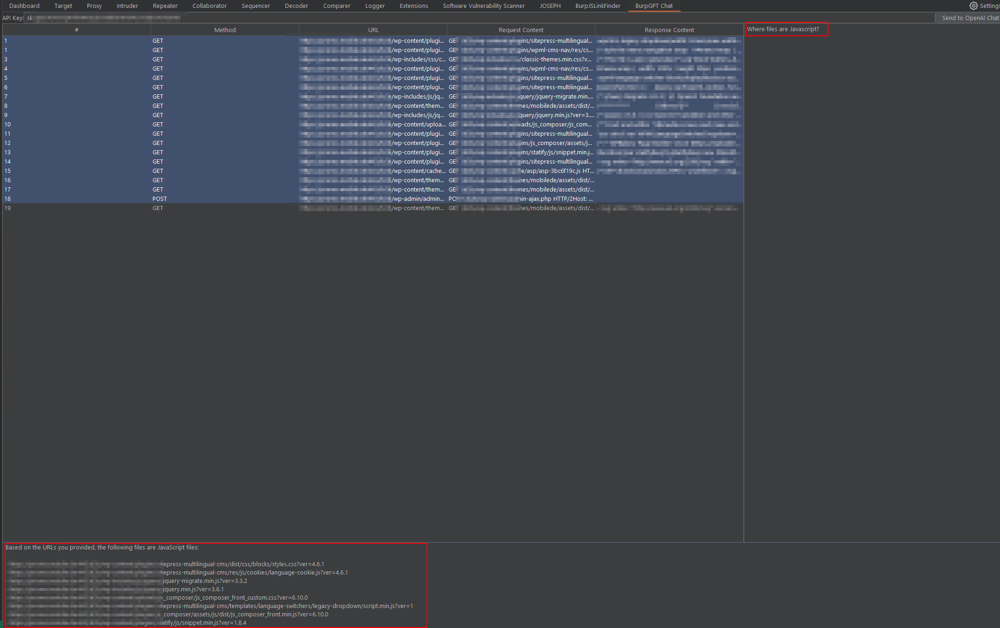

# burp-chat-plugin.py
This is a Python script for a Burp Suite extension that adds a new tab to the Burp Suite interface. The new tab includes a table with information about the HTTP requests and responses captured by Burp Suite, and a text area for the user to interact with an OpenAI chatbot.

# Example

